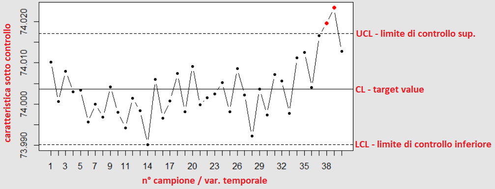
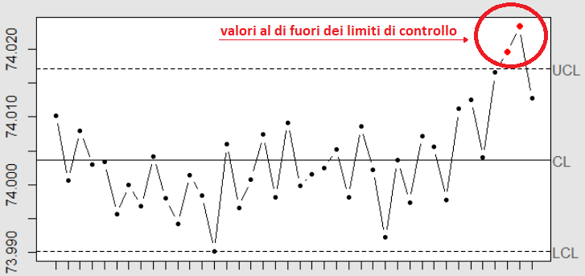

```{r setup, include=FALSE}
knitr::opts_chunk$set(cache = TRUE, message = FALSE, warning = FALSE)
```

## Controllo e miglioramento della qualità

La **qualità** di un prodotto e/o di un servizio gioca un ruolo fondamentale in ambito industriale.

La qualità di un prodotto può essere valutata misurandone varie caratteristiche, come: performance, affidabilità, durabilità, conformità agli standard, estetica, funzionalità etc.

In relazione a queste caratteristiche può essere data una definizione più formale:

> **La qualità è inversamente proporzionale alla variabilità**

dove con *variabilità* si intendono variazioni delle caratteristiche elencate.

---

L'**ingegneria della qualità** è un insieme di attività che una compagnia svolge al fine di assicurarsi che:

* le caratteristiche di un prodotto rientrino negli standard qualitativi richiesti;

* la variabilità attorno a questi valori sia più bassa possibile.

Quindi **controllare** la qualità di un prodotto significa **controllare la variabilità** introdotta in fase di produzione.

Per controllare e misurare la variabilità dei prodotti e dei processi efficacemente è necessario fare uso di **metodi statistici**.


## Metodi statistici per il controllo qualità
I metodi statistici a supporto delle attività dell'ingegneria della qualità possono essere suddivisi principalmente in tre aree:

- **Controllo statistico di processo** (**SPC** - *Statistical process control*);
- **Progettazione di esperimenti **(**DoE** - *Design of experiments*);
- **Controllo di accettazione** (*Acceptance sampling*).

## Controllo statistico di processo - SPC
L'SPC può essere definito, in modo sintetico, come:

>**l'applicazione di tecniche statistiche per comprendere ed analizzare le variabilità di un processo.**

L'SPC fa largo uso dei **diagrammi di controllo**.

```{r, out.width = "182px",echo=FALSE,fig.align='center'}
library(qcc)
data(pistonrings)
diameter <- qcc.groups(pistonrings$diameter, pistonrings$sample)
```
```{r,echo=FALSE, out.width = "520px",fig.align='center'}
qcc.options(run.length=100000) # disabling run length: per esposizione...
qcc_obj <- qcc(diameter,type="xbar",add.stats=FALSE,xlab="n° campione",ylab="Media campionaria",title="Diagramma di Controllo")
```

## Diagrammi di controllo
I diagrammi di controllo (o diagrammi **Shewhart**) sono strumenti di controllo statistico di processo impiegati per il monitoraggio di una caratteristica qualitativa di un prodotto.

Le componenti principali sono:

- due **limiti di controllo**: superiore e inferiore (UCL - LCL)
- un valore medio (target - valore nominale della caratteristica controllata)

```{r, out.width = "600px",echo=FALSE,fig.align='center'}

```

---

Il diagramma traccia l'andamento di una caratteristica qualitativa del prodotto da tenere sotto controllo, ad esempio la media campionaria.

Possono verificarsi quindi due casi:

- i valori osservati rientrano nell'intervallo di controllo: **il processo è sotto controllo**

- contrariamente, i campioni hanno rilevato anomalie nel processo di produzione

```{r, out.width = "525px",echo=FALSE,fig.align='center'}

```

## QCC - Quality Control Charts

**QCC** è un pacchetto R che fornisce strumenti statistici a supporto delle operazioni di controllo e miglioramento della qualità.

QCC permette principalmente la creazione di **diagrammi di controllo**, come:

- Diagrammi di controllo qualità di tipo Shewhart;
- Diagrammi CUSUM e EWMA;
- Curve operative caratteristiche (OC - Operating characteristic curves);
- Analisi delle capacità di processo;
- Diagrammi di Pareto e diagrammi causa-effetto;
- Diagrammi di controllo multivariati.

## Controllo della media campionaria

Caratteristica monitorata: **media campionaria $\bar{x}$**

```{r, out.width = "525px",fig.align='center',echo=FALSE}
qcc.options(run.length=100000) # disabling run length: per esposizione...
qcc_obj <- qcc(diameter,type="xbar")
```

I **limiti di controllo** vengono calcolati sulla base di una opportuna statistica test basata su distribuzione normale standard.


## Controllo della variabilità
Due semplici diagrammi per il controllo della variabilità di processo plottano, in riferimento ai campioni osservati, l'**andamento dei range campionari** e della **deviazione standard campionaria**.

```{r,echo=FALSE, out.width = "600px",fig.align='center'}
qcc_obj <- qcc(diameter,type="R", title="R Chart - Range campionari")
```

---

```{r,echo=FALSE, out.width = "600px",fig.align='center'}
qcc_obj <- qcc(diameter,type="S",std.dev="RMSDF",title="S Chart - SD campionarie")
```

Anche qui, i limiti di controllo vengono calcolati sulla base della distribuzione campionaria di opportune statistiche test.

## Diagrammi CUSUM e EWMA

Principale **svantaggio** dei diagrammi Shewhart: si basano sulle informazioni fornite solo dall'ultimo campione; ignorando l'**andamento** della caratteristica controllata.

Due alternative sono:

- **CUSUM**: **CU**mulative **SUM** control chart
- **EWMA**: **E**xponentially **W**eighted **M**oving **A**verage

**Vantaggio:** permettono il rilevamento di piccole variazioni (anche permanenti) nel processo di produzione.

## Cumulative Sum Control Chart
Esempio esplicativo (*con dati sintetici*):

- Si pensi a un processo di produzione con $\mu = 10$ e $\sigma = 1$ in stato di controllo

- Dopo un certo istante, le osservazioni successive hanno tutte $\mu = 11$ e $\sigma = 1$

Il processo ha quindi subito uno **shift** pari a 1 dal valore target.

**Problema:** Un diagramma di controllo, nel caso che queste osservazioni ricadano all'interno dei limiti di controllo non segnalerà mai l'anomalia.

---

Rappresentazione grafica dell'esempio: **shift di processo non rilevato**

```{r,echo=FALSE, out.width = "650px",fig.align='center'}
sample = c(3.09,3.04,2.95,3,3.08,2.92,2.96,3.1,2.9,4.1,4.05,3.9,3.96,4.09,4,3.88,4.04,4)
qcc.options(run.length=10000)
q = qcc(sample,type="xbar.one",nsigmas=2,center=3,std.dev=1,title="Esempio shift di processo non rilevato da diagramma Shewart",add.stats=FALSE,xlab="n° campione",ylab="media campionaria")

```

---

Diagramma delle somme cumualtive sui dati dell'esempio:

```{r,echo=FALSE, out.width = "650px",fig.align='center'}
qcc_obj <- cusum(sample,decision.interval = 2,center=3,title="CUSUM - Esempio shift di processo costante pari a ~1",xlab="n° campione",std.dev=1,add.stats=FALSE)
```

Come possiamo vedere il diagramma **CUSUM** rileva una anomalia, in quanto nel processo è presenta una deviazione permanente dal valore target.


## Exponentially Weighted Moving Average
Il diagramma EWMA è molto simile al diagramam CUSUM: si basa sulla media in movimento, calcolata con pesi che decadono con legge esponenziale (*i dati recenti sono più significativi*).

**Vantaggi:** rilevamento di piccoli shift permanenti sul processo migliore rispetto ai diagrammi Shewhart (migliori per grandi shift).

Segue un altro esempio con dati sintetici.

---

Rappresentazione grafica dell'esempio: **shift di processo non rilevato**

```{r,echo=FALSE, out.width = "650px",fig.align='center'}
qcc.options(run.length=10000)
sample = c(3.09,3.04,2.95,3,3.08,2.92,2.96,c(3.1,2.9,3.1,3.05,2.9,2.96,3.09,3,2.88,3.04,3)+0.2)
q = qcc(sample,center=3,nsigmas=3,type="xbar.one",add.stats = FALSE,title="Esempio shift di processo non rilevato da diagramma Shewart",xlab="n° campione",ylab="media campionaria")
```

---

```{r,echo=FALSE, out.width = "650px",fig.align='center'}
qcc_obj <- ewma(sample,center=3,title="EWMA - Esempio shift di processo",ylab="EWMA",xlab="n° campione",add.stats=FALSE,lambda=0.5,nsigmas=3)
```

Il diagramma **EWMA**, basandosi sulla media in movimento che sfrutta anche l'informazione delle osservazioni precedenti è in grado di rilevare lo shift di processo.

## Curve caratteristiche di processo
Una **curva caratteristica operativa** fornisce una misura delle performance di un piano di campionamento semplice.

**Campionamento semplice**: un lotto viene sottoposto a una ispezione di qualità:

- $N$ dimensione del lotto;
- $n$ dimensione del campione ($n < N$);
- $c$ numero di accettazione;
- $d$ numero di unità difettose osservate.

Si verificheranno due possibili casi:

- $d>c$: il lotto verrà scartato;
- $d \leq c$: il lotto sarà accettato.

---

La curva viene calcolata sotto ipotesi che il campionamento semplice segua legge **Binomiale Bi(n,p)** con $n=$ dim. campione e $p=$ fazione difettosi nel campione.

Le curve OC ripotarno il **potere discriminante** del campionamento semplice, riportando la probabilità di commettere un errore di **tipo II** (accettare un lotto che non rispetta il criterio di accettazione).

```{r,echo=FALSE, out.width = "550px",fig.align='center'}
data(orangejuice)
attach(orangejuice)
qcc_p_obj = qcc(D[trial], sizes=size[trial], type="p", plot=FALSE)
q = oc.curves(qcc_p_obj)
```

## Analisi capacità di processo
Il seguente diagramma fornisce una stima della **capacità di processo**, ovvero della sua uniformità nel tempo.

```{r,echo=FALSE, out.width = "550px",fig.align='center',results=FALSE}
qcc_obj = qcc(diameter[1:25,], type="xbar", plot=FALSE)
p <- process.capability(qcc_obj, spec.limits=c(73.97,74.03))
```

Il valore $C_{p}$ è una indicazione numerica per esprimere la capacità di processo.

---
Calcolo di $C_{p}$:
$$
\hat{C_{p}}=\frac{\mathrm{USL}-\mathrm{LSL}}{6 \hat{\sigma}}
$$
Al diminuire della deviazione standard dei campioni, la capacità di processo $C_{p}$ aumenta, fornendo quindi indicazione di un processo più stabile.

Il diagramma fornisce anche altre informazioni come:

- n° osservazioni al di fuori dei limiti di controllo
- n° osservazioni al di fuori dei limiti di controllo in base a una approssimazione di distribuzione normale con $\mu=$ target e dev. std. campionaria.


## Diagramma di Pareto
Un diagramma di pareto è un **barplot** in cui le categorie sono ordinate in ordine decrescente in base alle **frequenze relative**.

Viene tipicamente usato per **identificare i fattori che hanno il maggiore effetto cumulativo sul sistema**.

```{r,echo=FALSE, out.width = "550px",fig.align='center',results=FALSE}
defect = c(210, 30, 66, 109, 23)
names(defect) = c("diametro sup.", "test durezza", "diametro inf.", "lunghezza", "test torsione")
pareto.chart(defect, ylab = "Frequenza d'errore")
```

## Diagramma Causa-Effetto
Il diagramma causa effetto viene utilizzato per avere una visione chiara delle associazioni causa-effetto in fase di **prevenzione dei difetti di qualità**.

```{r, out.width = "530px",fig.align='center',warning=FALSE,echo=FALSE}

causes=list(
  Macchinari=c("Mancata \n manutenzione","Utensile errato","Calibrazione \n errata"),
  Personale=c("Non qualificato","Bassa attitudine","Supervisione inadeguata"),
  Misurazioni=c("Specifiche errate","Strumeto errato","Specifiche non chiare"),
  Materiali=c("Qualità non rispettata \n dal fornitore","Danneggiato"))
cause.and.effect(cause=causes,effect="Difetti sul \n prodotto")
```

Il diagramma causa-effetto aiuta anche a capire le cause dei difetti (variabilità) nel prodotto finale.

## Diagrammi di controllo Multivariati
In ambito industriale risulta spesso necessario controllare **simultaneamente** l'andamento di **2 o più caratteristiche di qualità** di un prodotto.

```{r, out.width = "500px",fig.align='center',warning=FALSE,echo=FALSE}
x1 = matrix(c(72, 56, 55, 44, 97, 83, 47, 88, 57, 26, 46, 
49, 71, 71, 67, 55, 49, 72, 61, 35, 84, 87, 73, 80, 26, 89, 66, 
50, 47, 39, 27, 62, 63, 58, 69, 63, 51, 80, 74, 38, 79, 33, 22, 
54, 48, 91, 53, 84, 41, 52, 63, 78, 82, 69, 70, 72, 55, 61, 62, 
41, 49, 42, 60, 74, 58, 62, 58, 69, 46, 48, 34, 87, 55, 70, 94, 
49, 76, 59, 57, 46), ncol = 4)
x2 = matrix(c(23, 14, 13, 9, 36, 30, 12, 31, 14, 8, 10, 
11, 22, 21, 18, 15, 13, 22, 19, 10, 30, 31, 22, 28, 10, 35, 18, 
11, 10, 11, 8, 20, 16, 19, 19, 16, 14, 28, 20, 11, 28, 8, 6, 
15, 14, 36, 14, 30, 8, 35, 19, 27, 31, 17, 18, 20, 16, 18, 16, 
13, 10, 9, 16, 25, 15, 18, 16, 19, 10, 30, 9, 31, 15, 20, 35, 
12, 26, 17, 14, 16), ncol = 4)

x = list(x1 = x1, x2 = x2)

```

```{r, out.width = "500px",fig.align='center',warning=FALSE,echo=FALSE}
q = mqcc(x, type = "T2", add.stat = FALSE, xlab = "n° campione")

```

*QCC* ci viene in contro con i **diagrammi di controllo multivariati**, basati sulla legge di distribuzione congiunta delle due o più caratteristiche e su una opportuna statistica.

## Hotelling $T^2$ e ellipse-chart

Il diagramma riportarto permette di tracciare osservazioni multivariate su un unico grafico, basandosi su una statistica che combina le informazioni della media e la dispersione di più di una variabile (Hotelling $T^2$)

Nel caso **bivariato** è possibile rappresentare la regione di accettazione con un diagramma ellisse


```{r, out.width = "500px",fig.align='center',warning=FALSE,echo=FALSE}
ellipseChart(q,show.id = TRUE)
```

## Conclusioni

**QCC** oltre alle funzionalità di base appena elencate, permette molto altro:

- per ogni diagramma sono presenti molti parametri di configurazione
- fornisce dataset di test
- fornisce svariati metodi alternativi per il calcolo delle varie statistiche (*standard dev, media pesata in movimento, somme cumulative etc. etc.*)
- permette test d'ipotesi
- fornisce molte più varianti dei diagrammi Shewart oltre a quelli illustrati
- etc.


