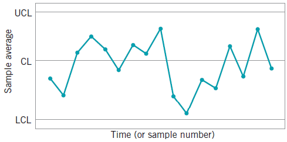
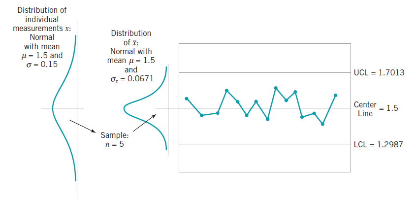
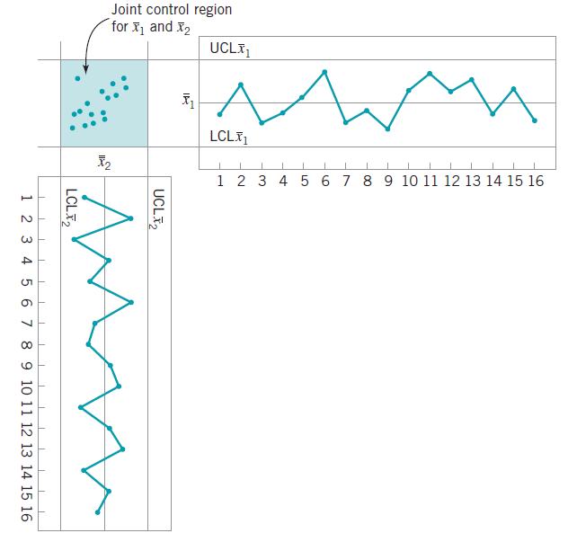

```{r setup, include=FALSE}
knitr::opts_chunk$set(echo = TRUE)
```

# Introduzione
L'obiettivo di questo elaborato consiste nell'introdurre **QCC**, un pacchetto R che fornisce strumenti statistici a supporto delle operazioni di controllo e miglioramento della qualità. Al fine di comprenderne al meglio le funzionalità, veranno prima introdotti alcuni concetti base relativi all'ingegneria della qualità e i principali metodi statistici alla base di queste attività.

## Controllo e miglioramento della qualità [1]
Il controllo e il miglioramento della qualità è diventata un'importante strategia aziendale per molte organizzazioni; produttori, distributori, società di trasporti, organizzazioni finanziarie; fornitori di assistenza sanitaria etc. La qualità è un vantaggio competitivo. Un business che può deliziare i propri clienti migliorando e controllando la qualità dei propri prodotti e/o servizi può dominare sulla concorrenza.

Possiamo definire il concetto di *qualità* in molti modi. La maggior parte delle persone ha una comprensione astratta della qualità in relazione a una o più caratteristiche desiderabili che un prodotto o servizio dovrebbe possedere.

La qualità è diventata uno dei più importanti fattori decisionali dei consumatori nella selezione tra prodotti e servizi concorrenti. Di conseguenza, la comprensione e il miglioramento della qualità sono fattori chiave che portano al successo, alla crescita e alla competitività di un business. 

La qualità di un prodotto può essere descritta e valutata in diversi modi. Si può riassumere il concetto di qualità con queste 8 "dimensioni" di qualità [Garvin - 1987]:

1. Performance: il prodotto svolge il compito per cui è stato progettato?
2. Affidabilità: quante volte il prodotto fallisce nel svolgere il suo compito?
3. Durabilità: quanto dura il prodotto?
4. Facilità di manutenzione: quanto è difficile da riparare?
5. Estetica: soddisfa le proprietà estetiche?
6. Funzionalità: cosa è in grado di fare il prodotto?
7. Qualità percepita: qual'è la reputazione del prodotto e dell'azienda?
8. Conformità agli standard: il prodotto rispecchia le specifiche di progetto?

In relazione a queste caratteristiche, possiamo dare una definizione più formale di qualità:

> *La qualità è inversamente proporzionale alla variabilità*

dove con **variabilità** si intendono differenze in termini delle caratteristiche precedentemente elencate tra un esemplare e un altro dello stesso prodotto.

Con *aumento della qualità* si intende quindi la riduzione della variabilità nei processi e nei prodotti.

Ogni prodotto possiede un numero di parametri spesso chiamati caratteristiche **critical-to-quality (CTQ)**, che possono essere di tipo fisico (lunghezza, peso etc.), sensoriale (colore, apparenza etc.) o orientati al tempo (affidabilità, durabilità etc.). Si noti come queste caratteristiche siano direttamente correlate alle 8 "dimensioni" elencate precedentemente.

L'**Ingegneria della qualità** è un insieme di attività che una compagnia svolge al fine di assicurarsi che le caratteristiche di un prodotto rientrino negli standard qualitativi richiesti e che la variabilità attorno a questi valori sia più bassa possibile.

Poiché la variabilità può essere descritta solo in termini statistici, i metodi statistici giocano un ruolo centrale negli sforzi di miglioramento della qualità. 

Le caratteristiche di qualità sono spesso valutate rispetto alle specifiche. Per un prodotto, le specifiche sono le misure desiderate per le caratteristiche di qualità dei componenti del prodotto, nonché i valori desiderati per le caratteristiche di qualità del prodotto finale.

Un valore di una misurazione che corrisponde al valore desiderato per quella caratteristica di qualità è chiamato **valore nominale** o obiettivo (target) per quella caratteristica. Questi valori nominali sono solitamente delimitati da un intervallo di valori che riteniamo siano sufficientemente vicini al target in modo da non influire sulla funzione o sulle prestazioni del prodotto se la caratteristica di qualità è in quel range. 

Il valore massimo consentito per una caratteristica di qualità è chiamato
**limite di specifica superiore (USL - upper specification limit)** e il valore minimo consentito per una caratteristica di qualità è chiamato **limite inferiore di specifica (LSL - lower specification limit)**. 

Parliamo di **prodotto non conforme** quando esso non rispetta una o più caratteristiche di qualità (una caratteristica è al di fuori dei valori nominali). Un prodotto è considerato quindi difettoso se possiede uno o più difetti, ovvero non conformità che precludono l'utilizzo del prodotto.

## Metodi statistici per il controllo qualità [1]
L'obiettivo primario dell'ingegneria della qualità è la sistematica riduzione della variabilità nelle caratteristiche chiave relative alla qualità del prodotto finale, e per fare ciò, fa uso della statistica.

I metodi statistici a supporto delle attività dell'ingegneria della qualità possono essere suddivisi principalmente in tre aree:

- Controllo statistico di processo (**SPC** - *Statistical process control*);
- Progettazione di esperimenti (**DoE** - *Design of experiments*);
- Controllo di accettazione (*Acceptance sampling*).

### SPC -- Controllo statistico di processo
Il controllo statistico di processo può essere definito come una metodologia che, in riferimento ad una determinata attività, operazione, fase o processo caratterizzato da ripetitività, fa ricorso a tecniche statistiche al fine di definire, analizzare e verificare le condizioni che determinano la variabilità dell'oggetto di analisi.

In modo più sintetico, potremmo definire l'SPC come:

>*l'applicazione di tecniche statistiche per comprendere ed analizzare le variabilità di un processo.*

Un **grafico di controllo** è una delle tecniche primarie  dell'SPC. Un grafico di controllo tipico traccia le medie delle misurazioni di una caratteristica di qualità nei campioni prelevati dal processo rispetto al tempo (o il numero del campione).
Il grafico ha una linea centrale (CL) e limiti di controllo superiore e inferiore.

```{r, out.width = "182px",echo=FALSE,fig.align='center'}

```

I grafici di controllo sono una tecnica di monitoraggio del processo molto utile;
quando sono presenti fonti di variabilità insolite, le medie campionarie verranno tracciate al di fuori dei limiti di controllo. Questo è un segnale che è necessario effettuare alcune indagini sul processo e effettuare azioni correttive per rimuovere le fonti di variabilità riscontrate. L'uso sistematico di un grafo di controllo è un metodo eccellente per ridurre la variabilità.

### DoE -- Progettazione di esperimenti
Un esperimento statistico è estremamente utile per scoprire le variabili chiave che influenzano le caratteristiche qualitative di interesse nel processo. Un esperimento è un approccio che varia sistematicamente i fattori di input controllabili nel processo per determinare l'effetto che questi fattori hanno sui parametri del prodotto in uscita.

Esperimenti progettati statisticamente hanno un valore inestimabile nel ridurre la variabilità delle caratteristiche di qualità e nel determinare i livelli delle variabili controllabili che ottimizzano le prestazioni del processo. Spesso significativi miglioramenti nel processo di produzione sono il risultato dell'utilizzo accurato di esperimenti statistici.

Un esempio di esperimento statistico in ambito del controllo qualità è il cosiddetto **esperimento fattoriale completo** (*factorial design experiment*), ovvero, un esperimento in cui i fattori vengono variati insieme, in modo tale da testare tutte le possibili combinazioni dei livelli dei fattori. Tale esperimento consente allo sperimentatore di studiare l'effetto di ciascun fattore sulla variabile di risposta, nonché gli effetti delle interazioni tra i fattori sulla variabile di risposta.

Esperimenti di questa natura sono un importante strumento di controllo della qualità *off-line*, perché spesso vengono utilizzati durante le attività di sviluppo e le prime fasi della produzione, piuttosto che come procedura di routine durante la produzione (*on-line*). Una volta identificato un elenco di variabili importanti che influenzano l'output del processo, è normalmente necessario modellare la relazione tra le variabili di input influenti e le caratteristiche di qualità in output. Le tecniche statistiche utili nella costruzione di tali modelli tipicamente includono analisi della regressione e analisi di serie temporali.

### Controllo di accettazione
La terza area del controllo e miglioramento della qualità è il **controllo di accettazione**. Questa attività è strettamente legata al concetto di ispezione e testing del prodotto. L'ispezione può avvenire in molti punti di un processo. Il controllo di accettazione (o *campionamento di accettazione*), definito come:

> *l'ispezione e la classificazione di un campione di unità selezionate a caso da un lotto e la decisione finale sulla disposizione del lotto stesso*

di solito si verifica in due punti: sulle materie/componenti in input o sul prodotto finale.

Il controllo di accettazione tende a rafforzare la visione della conformità alle specifiche qualità e non ha alcun feedback né sul processo di produzione né sull'ingegneria progettazione o sviluppo che porterebbero necessariamente al miglioramento della qualità, in quanto si tratta semplicemente di controllare se il prodotto finale rispetta o meno gli standard di qualità prestabiliti.
\pagebreak

# QCC
Un pacchetto molto utile a supporto delle attività sopra descritte è **QCC**.

QCC è un pacchetto per l'ambiente statistico **R** focalizzato sulla creazione di grafici per il controllo qualità. Le principali funzionalità fornite dal pacchetto sono creare/effettuare:

- Grafici di controllo qualità di tipo *Shewhart* per variabili continue, categoriali e dati di conteggio;
- Grafici *CUSUM* e *EWMA*;
- Curve operative caratteristiche (*OC - Operating characteristic curves*);
- Analisi delle capacità di processo;
- Diagrammi di Pareto e diagrammi causa-effetto;
- Diagrammi di controllo multivariati.

*QCC* è un pacchetto open-source, sviluppato da Luca Scrucca, accessibile dal seguente link: https://luca-scr.github.io/qcc/index.html, disponibile nell'archivio del CRAN. Ad oggi (*gennaio - 2021*) l'ultima versione rilasciata del pacchetto è la *2.7*, ma è presente una versione più recente in via di sviluppo (scaricabile manualmente da repository GitHub). In questo elaborato verrà utilizzata l'ultima versione rilasciata (*2.7*).

```{r,eval=FALSE,include=FALSE}
install.packages("qcc") # 2.7 è l'ultima versione sul CRAN, 3.0 su GitHub
```

In merito a quanto visto nel capitolo precedente, è intuibile come il pacchetto *QCC* fornisca maggior supporto (ma non unicamente) alla fase di *Controllo statistico di processo - SPC*, nello specifico quindi fornisce utili diagrammi di controllo qualità.

L'elaborato, dopo una prima introduzione ai concetti e alle funzionalità principali del pacchetto, mirerà a illustrare le varie funzionalità fornite, cercando di enfatizzarne gli usi pratici e le applicazioni possibili.

*QCC* fornisce inoltre una manciata di dataset utili per testarne le funzionalità:

- boiler
- circuit
- dyedcloth
- orangejuice e orangejuice2
- pcmanufact
- pistonrings

## Concetti base di QCC
Il blocco di partenza per qualsiasi operazione effettuabile mediante il pacchetto è l'oggetto *QCC*, creabile invocando la funzione *qcc*.

Nella forma più semplice la funzione **qcc** richiede 2 argomenti:

- **data**: data frame, matrice o un vettore contenente i dati osservati;
- **type**: una stringa indicante la tipologia di diagramma che si vuole ottenere.

Gli ulteriori parametri verranno illustrati e contestualizzati man mano, qualora utilizzati.

## Grafici di controllo qualità di tipo Shewhart per variabili continue [1,2,3,5]
Quando si parla di diagramma **Shewhart** ci si riferisce a un insieme di diagrammi di controllo sviluppati in accordo con i principi proposti dall'ononimo *Walter A. Shewhart* [1 - pag 185].

Questi diagrammi di controllo tracciano tipicamente una caratteristica qualitativa di un prodotto che è stata misurata o calcolata da un campione in relazione al tempo o al numero di campione. Questi diagrammi contengono una linea centrale rappresentante il valore medio della misura qualitativa in stato di conformità e due linee orizzontali chiamate **limite di controllo superiore** e **limite di controllo inferiore** (UCL e LCL), rappresentanti i valori massimi per rientrare nell'intervallo di conformità.

Quando i valori ricadono sempre all'interno dell'intervallo specificato da UCL e LCL, il processo è considerato sotto controllo. Valori al di fuori dell'intervallo sono da interpretare come evidenza che il processo non è sotto controllo. Va specificato che, anche se i valori ricadono all'interno dell'intervallo ma possiedono un andamento repentino, è comunque necessario investigarne la causa.

È presente una elevata connessione tra i diagrammi di controllo e il concetto di test di ipotesi. Si consideri il caso in cui l'asse verticale rappresenti la media campionaria $\bar{x}$. Allora abbiamo due possibili casi:

- LCL $\leq \bar{x} \leq$ UCL = il processo è sotto controllo;
- in caso contrario, è una evidenza che il processo non è sotto controllo.

Un diagramma di controllo può essere visto quindi come un test d'ipotesi secondo cui il processo è sotto controllo (ipotesi nulla: la media del campione coincide con la media in stato di conformità).

Per comprendere al meglio questi diagrammi, si consideri come vengono calcolati i limiti di controllo superiore e inferiore. A titolo esplicativo si consideri un processo in cui la misura nominale è 1.5 micron e la deviazione standard 0.15 micron. Nel caso in cui un campione abbia dimensione $n=5$ la deviazione standard della media campionaria $\bar{x}$ risulta essere:

$$
\sigma_{\bar{x}}=\frac{\sigma}{\sqrt{n}}=\frac{0.15}{\sqrt{5}}=0.0671
$$
Per il teorema centrale del limite possiamo assumere che la media campionaria $\bar{x}$ sia in modo approssimato distribuita secondo legge normale standard. Questo ci permette di calcolare degli intervalli di confidenza di probabilità $\alpha$.

Si scelga $Z_{\alpha/2} = 3$ come costante ($3 \sigma$ -- *si veda postilla*), valore tipicamente utilizzato, allora UCL e LCL vengono calcolati come segue:

$$
\begin{array}{l}
\mathrm{UCL}=1.5+3(0.0671)=1.7013 \\
\mathrm{LCL}=1.5-3(0.0671)=1.2987
\end{array}
$$

Si noti quindi che la scelta dei valori UCL e LCL coincide con il test di ipotesi:

$$
\begin{array}{ll}
H_{0}: & \mu=1.5 \\
H_{1}: & \mu \neq 1.5
\end{array}
$$
con deviazione standard nota (0.15). Un riassunto grafico è il seguente:

```{r, out.width = "375px",echo=FALSE,fig.align='center'}

```
Si noti come questo fosse un esempio specifico di diagramma di controllo Shewhart per la media campionaria (segue quindi l'assunzione di distribuzione normale).


\newpage
Quando si ha a che fare con una caratteristica di qualità che è una variabile, di solito è necessario monitorare sia il valore medio della caratteristica di qualità che la sua variabilità. 

Il controllo del valore medio di qualità viene solitamente eseguito con diagrammi di controllo detti **diagrammi $\bar{x}$**. La variabilità del processo può essere monitorata sia con un diagramma di controllo della deviazione standard (**diagramma S**) o con un diagramma di controllo per i range (**diagramma R**).
\vspace{6mm}

Vediamo ora le funzionalità di **QCC** in relazione ai diagrammi **Shewhart**.

*QCC* fornisce i seguenti diagrammi *Shewhart*:

* Diagrammi di controllo per variabili:
  - **xbar** ($\bar{x}$): le medie campionarie vengono plottate per controllare il valore medio di una variabile continua di processo;
  - **xbar.one** ($\bar{x}$): valori campionari da un processo *one-at-time* vengono plottati per controllare il livello medio di una variabile di processo;
  - **R**: i range campionari vengono plottati per controllare la variabilità di una variabile continua di processo;
  - **S**: vengono plottate le deviazioni standard campionarie per controllare la variabilità di una variabile continua di processo;
* Diagrammi di controllo per attributi:
  - **p**: viene plottata la proporzione di unità non conformi. I limiti di controllo sono basati su una distribuzione binomiale;
  - **np**: viene plottato il numero di unità non conformi. I limiti di controllo sono basati su una distribuzione binomiale;
  - **c**: vengono plottati il numero di difetti per unità, basandosi su una distribuzione Poisson;
  - **u**: vengono plottati il numero di difetti per unità, basandosi su una distribuzione Poisson ma senza il vincolo di un numero costante di unità.
  
Si noti che questi sono possibili input del parametro **type** della chiamata alla funzione *QCC* citato precedentemente. Vediamo ora un esempio di ciascuna variante per le variabili, discutendone le principali caratteristiche.

Useremo il dataset *pistonrings* (fornito da *QCC*) relativo a 40 misurazioni (in campioni da 5 elementi) del diametro di anelli raschia olio per pistoni.

```{r,include=FALSE}
library(qcc)
data(pistonrings)
```

```{r,echo=FALSE}
head(pistonrings,7)
```

I diagrammi Shewhart sono generalmente basati su diversi campioni con osservazioni raccolte in momenti diversi. Ciascun campione deve essere fornito a *QCC* come una riga di un dataframe o di una matrice. La funzione **qcc.groups** può essere utilizzata per raggruppare facilmente un vettore di valori di dati basati su un indicatore campione. Sono consentite dimensioni del campione diverse.

```{r}
diameter <- qcc.groups(pistonrings$diameter, pistonrings$sample)
head(diameter,3)
```


### Shewhart xbar
Creiamo come prima dimostrazione un diagramma di controllo Shewhart di tipo *xbar* in cui verranno plottate le medie campionarie dei nostri campioni da 5 misurazioni ciascuno.

```{r, out.width = "325px",fig.align='center'}
qcc_obj <- qcc(diameter,type="xbar")
```

By default viene plottato un diagramma e viene restituito un oggetto di classe *qcc*. Da questo oggetto è possibile recuperare delle statistiche riassuntive tramite il comando *summary*.

```{r}
summary(qcc_obj)
```

Come accennato nell'introduzione dei diagrammi di controllo di tipo Shewhart, i valori LCL e UCL (possiamo chiamarlo intervallo di conformità) vengono calcolati assumendo distribuzione normale standard e 3 volte $\sigma$. 3 risulta il valore di default, modificabile mediante il parametro **nsigmas**.
\newpage

```{r, out.width = "325px",fig.align='center'}
qcc_obj <- qcc(diameter,type="xbar",nsigmas=2)
```


Invece di utilizzare i calcoli standard per il calcolo delle statistiche e dei due limiti di controllo; il centro, la deviazione standard all'interno dei gruppi e i limiti di controllo possono essere specificati direttamente tramite i parametri corrispondenti: **center, std.dev, limits**.

Ipotizzando di essere a conoscenza della deviazione standard, con un valore nominale del diametro pari a 74, otterremmo il seguente diagramma:

```{r, out.width = "325px",fig.align='center'}
qcc_obj <- qcc(diameter,type="xbar",center=74,std.dev=0.005)
```

Il parametro limits invece torna utile per specificare intervalli di conformità personalizzati, volendo anche non simmetrici, esempio:


\newpage
```{r, out.width = "315px",fig.align='center'}
qcc_obj <- qcc(diameter,type="xbar",center=74,limits=c(73.995,74.04))
```


### Altri parametri

Altri parametri della chiamata *QCC* sono i seguenti:

**add.stats**: di default TRUE, se impostato su FALSE non vengono incluse nel diagramma le statistiche calcolate;

**confidence.level**: ci permette di specificare un valore numerico tra 0 e 1 utilizzato per specificare l'intervallo di confidenza dei limiti sup. e inf. (se specificato, il parametro *nsigmas* viene ignorato);

**newdata**: una volta che un processo è considerato "sotto controllo", possiamo utilizzare i limiti calcolati per il monitoraggio di nuovi dati campionati dallo stesso processo in corso. Segue un esempio:

```{r,echo=FALSE, out.width = "315px",fig.align='center'}
qcc_obj <- qcc(diameter[1:15,],type="xbar",newdata=diameter[16:40,])
```

*QCC* in questo caso crea un diagramma con i dati vecchi e nuovi (è possibile specificare tramite **chart.all=FALSE** di plottare solo i dati nuovi), le cui statistiche e i limiti di controllo sono stati calcolati sulla base dei dati vecchi (nel nostro caso i primi 15 campioni).

### Interpretazione del diagramma
Dall'esempio successivo è possibile notare punti di 3 colori diversi:

- **nero**: all'interno dei limiti di controllo;
- **rosso**: al di fuori dei limiti di controllo;
- **giallo**: *QCC* permette di impostare un parametro **run.length** (default = 7) indicante il numero di punti consecutivi al di sopra o sotto alla linea centrale. Qualora questo conteggio venisse raggiunto, un punto viene marcato come giallo (fuori controllo). Questo parametro particolare può essere utilizato per riscontrare situazioni non sotto controllo, come nel caso delle *Western Electric rules* che richiedono questa tipologia di controlli (*si veda postilla*).

### Shewhart xbar.one
Simile al diagramma *xbar*, ma i valori campionari provengono da un processo one-at-time e vengono plottati per controllare il livello medio di una variabile di processo. Con processo one-at-time si intendono quei casi in cui si monitora una certa caratteristica del prodotto con campioni di dimensione 1 (*alternative: CUSUM e EWMA*).

Si noti come con il parametro **std.dev**, oltre a specificare un valore noto della deviazione standard, è possibile specificare il metodo utilizzato da *QCC* per il calcolo automatico:

- **MR** - Moving Range: questa stima è basata sulla media dei range in movimento; 
- **SD** - Deviazione standard campionaria.

```{r, out.width = "315px",fig.align='center'}
samples = pistonrings$diameter[1:15]
qcc_obj <- qcc(samples,type="xbar.one",std.dev = "MR")
```

### Shewhart R
I range campionari vengono plottati per controllare la variabilità di una variabile continua di processo. Si supponga siano disponibili $m$ campioni da $n$ osservazioni. Se $x_{1},\ldots,x_{n}$ è un campione di dimensione $n$, il **range** di quel campione è definito come: 

$$R=x_{max}-x_{min}$$

Dati i range campionari dei $m$ campioni, definiamo con $\bar{R}$ la loro media. I limiti di controllo per il diagramma $R$ sono quindi calcolati come segue:

$$
\begin{aligned}
\mathrm{UCL} &= \bar{R} + 3\sigma_{\bar{R}} \\
\text { Center line } &=\bar{R} \\
\mathrm{LCL} & = \bar{R} - 3\sigma_{\bar{R}}
\end{aligned}
$$
Si noti che 3 è il valore default del parametro *nsigmas*.

```{r,echo=FALSE, out.width = "325px",fig.align='center'}
qcc_obj <- qcc(diameter,type="R")
```


### Shewhart S
Vengono plottate le deviazioni standard campionarie per controllare la variabilità di una variabile continua di processo;

```{r,echo=FALSE, out.width = "325px",fig.align='center'}
qcc_obj <- qcc(diameter,type="S",std.dev="RMSDF")
```

I diagrammi di tipo $S$ sono più accurati per popolazioni numerose, mentre i diagrammi di tipo $R$ sono consigliati per campioni piccoli. Si presume che le singole osservazioni siano indipendenti e normalmente distribuite.

\newpage
## Diagrammi CUSUM e EWMA
Uno degli svantaggi principali dei diagrammi di controllo Shewhart è il fatto che utilizzano informazioni sul processo relative solo alle osservazioni degli ultimi campioni, ignorando informazioni relative a tutta la catena di punti. Questo rende i diagrammi di controllo Shewhart relativamente **poco sensibili** alle leggere variazioni nel processo di produzione. Due alternative ai diagrammi Shewhart, utilizzati principalmente quando si è interessati a rilevare piccoli variazioni mentre il processo è considerato sotto controllo sono il diagramma CUSUM e EWMA:

- **CUSUM:** CUmulative SUM control chart;

- **EWMA:** Exponentially Weighted Moving Average.

### Cumulative Sum Control Chart (CUSUM)
Si pensi al caso in cui delle osservazioni da distribuzione normale con media $\mu = 10$ e $\sigma = 1$ siano all'interno del range di controllo. Ipotizziamo ora che altre 10 osservazioni vengano registrate, ma questa volta con distribuzione normale con media $\mu = 11$ e $\sigma = 1$. Un diagramma di controllo per la media campionaria probabilmente indicherebbe queste ultime 10 osservazioni come non anomale, in quanto sempre all'interno dei limiti di controllo, nonostante il processo abbia subito una deviazione pari a 1 dal centro della distribuzione.

Il diagrammma delle **somme cumulative** ci viene in aiuto, incorporando tutte le informazioni nella sequenza dei campioni, illustrando le somme cumulative delle deviazioni dei valori dei campioni dal valore target. Indicando con $\hat{x_{j}}$ la media del j-esimo campione e con $\mu_{0}$ il valore target, il diagramma plotta il valore:

$$
C_{i}=\sum_{j=1}^{i}\left(\bar{x}_{j}-\mu_{0}\right)
$$
Un esempio in *QCC*:

```{r out.width = "325px",fig.align='center'}
qcc_obj <- cusum(diameter,decision.interval = 4.75)
```

Il parametro **decision.interval** permette di specificare il numero di SE secondo cui la somma cumulativa è fuori controllo (default = 5).

*QCC* fornisce il diagramma CUSUM solo per variabili continue.


### Exponentially Weighted Moving Average (EWMA)
Il diagramma di tipo EWMA regola (*to smooth*) un insieme di dati basandosi su una media in movimento, con pesi che decadono con legge esponenziale. Anche questo diagramma è utile per identificare piccole e permanenti variazioni nella media del processo. 

La media pesata in movimento è definita come:

$$
z_{i}=\lambda x_{i}+(1-\lambda) z_{i-1}
$$

Un importante parametro è **lambda** ($0<\lambda<1$) che serve a specificare il parametro di smoothing. Se pari a 1, i punti vengono lasciati inalterati, se impostato a 0 la curva diventa una retta. Si noti come $\lambda$ specifica l'influenza della media dell'ultimo campione e della media in movimento precedentemente calcolata.

Nel grafico è possibile notare delle croci, queste rappresentano i punti iniziali.

```{r, out.width = "325px",fig.align='center'}
qcc_obj <- ewma(diameter,lambda=0.5)

```

## Curve caratteristiche operative (*OC - Operating characteristic curves*) [4]
Si ipotizzi che un lotto venga sottoposto a una ispezione di qualità. Definiamo allora:

- $N$ dimensione del lotto;
- $n$ dimensione del campione ($n < N$);
- $c$ numero di accettazione;
- $d$ numero di unità difettose osservate.

Si verificheranno due possibili casi:

- $d>c$: il lotto verrà scartato;
- $d \leq c$: il lotto sarà accettato.

Questa procedura è chiamata **piano di campionamento semplice** poiché il lotto è valutato
sulla base dell'informazione ricavata da un solo campione di dimensione n.

Una **curva caratteristica operativa (OC)** fornisce informazioni sulla probabilità di non rilevare un cambiamento nel processo, più nello specifico fornisce una misura delle performance del piano di campionamento semplice. La curva rappresenta la probabilità di accettazione del lotto in funzione della frazione di unità difettose.

Questa probabilità viene calcolata con l'ipotesi che la dimensione del lotto $N$ sia molto grande (ipoteticamente infinita). Sotto questa condizione, la distribuzione del numero di difetti $d$ in un campione casuale di $n$ elementi segue legge $Binomiale(n,p)$, con $p$ frazione di difettosi nel campione.

La curva OC è ottenuta valutando questa probabilità per vari valori di $p$, riportando il **potere discriminatorio** del piano di campionamento semplice.

Le curve OC possono essere facilmente ottenute da un oggetto di classe "qcc", ottenuto da un plot *Shewhart* di tipo **p** o **np**:

```{r, out.width = "300px",fig.align='center',warning=FALSE,include=FALSE}
data(orangejuice)
attach(orangejuice)
```

```{r, out.width = "290px",fig.align='center',warning=FALSE}
qcc_p_obj = qcc(D[trial], sizes=size[trial], type="p", plot=FALSE)
oc.curves(qcc_p_obj)
```

La curva OC costruita nell'esempio si basa sull'assunzione che i campioni provengano da un lotto molto grande, sotto assunzione che la distribuzione fosse di tipo binomiale. *QCC* permette di plottare curve OC anche per processi di campionamento basati su altre distribuzioni, più nello specifico, in base all'oggetto *QCC* che passeremo alla chiamata *oc.cuvers* otterremo:

- *xbar,R,S*: assunzione di distribuzione normale;
- *p,np*: assunzione di distribuzione binomiale;
- *c,u*: assunzione di distrubuzione Poisson;

```{r, out.width = "255px",fig.align='center',warning=FALSE}
qcc_x_obj = qcc(diameter, type="xbar", nsigmas=3, plot=FALSE)
oc.curves.xbar(qcc_x_obj, n=c(1,5,15))
```

## Analisi delle capacità di processo 
Il seguente diagramma di controllo fornisce informazioni sul valore di importanti parametri di processo e sulla loro **stabilità** nel tempo. Ciò consente di effettuare una stima della **capacità del processo**. 

In pratica confronta la distribuzione dei valori dei campioni con le specifiche dei limiti.

Con capacità di processo ci si riferisce all'uniformità del processo. Ovviamente, la variabilità di caratteristiche critiche per la qualità nel processo sono una misura dell'uniformità dell'output.

Definiamo l'analisi della capacità di processo come uno studio formale per stimare la capacità di processo. La stima della capacità di processo può essere sotto forma di una distribuzione di probabilità avente una forma specificata, una media e deviazione standard.

Spesso è conveniente disporre di un modo semplice e quantitativo per esprimere la capacità del processo. Un modo per farlo è attraverso il **rapporto di capacità di processo (PCR)**:
$$
\hat{C_{p}}=\frac{\mathrm{USL}-\mathrm{LSL}}{6 \hat{\sigma}}
$$

Il calcolo di questo valore deve essere svolto con l'assunzione che il processo sia sotto controllo, altrimenti i risultati sono insignificanti.

Possiamo quindi riassumenere il rapporto di capacità di processo come una misura dell'abilità del processo di produrre prodotti che rispettano le specifiche. Il valore $C_{p}$ assume che il processo abbia sia LSL che USL, per i due casi singoli, vengono definiti i due indici di capacità $C_{u}$ e $C_{l}$.

$$
\begin{array}{l}
C_{u}=\frac{\mathrm{USL}-\hat{\mu}}{3 \hat{\sigma}} \\
\\
C_{l}=\frac{\hat{\mu}-\mathrm{LSL}}{3 \hat{\sigma}}
\end{array}
$$
```{r, out.width = "300px",fig.align='center',warning=FALSE,results=FALSE}
qcc_obj = qcc(diameter[1:25,], type="xbar", plot=FALSE)
p <- process.capability(qcc_obj, spec.limits=c(73.97,74.03))
```

Dall'esempio ripotarto possiamo notare come:

- 0% delle osservazioni risultano > Upper SL;

- 0.8% delle osservazioni risultano < LSL;

I valori Exp rappresentano la frazione attesa, basata su un'approssimazione normale, delle osservazioni minori di LSL e maggiori di USL.

Una limitazione dell'indice $C_{p}$ è che non tiene conto di dove sia posizionata la media di processo in relazione alle specifiche, ma semplicemente misura la dispersione delle specifiche in relazione a $6 \sigma$. Questa situazione può essere descritta in maniera più accurata con l'indice $C_{pk}$, che appunto tiene in considerazione il centro del processo.

$$
C_{p k}=\min \left(C_{p u}, C_{p l}\right)
$$

Si noti come $C_{pk}$ non è altro che il PCR del limite di specifica più vicino alla media di processo. A titolo esplicativo, ricalcoliamo il diagramma di controllo sugli stessi dati ma shiftati a destra di 0.01. Come possiamo vedere il valore $C_{p}$ rimane invariato, ma i dati precedenti possiedono un valore $C_{pk}$ più elevato (il processo precedente ha una capacità più elevata).

```{r, out.width = "300px",fig.align='center',warning=FALSE,results=FALSE}
qcc_obj = qcc(diameter[1:25,]+0.01, type="xbar", plot=FALSE)
process.capability(qcc_obj, spec.limits=c(73.97,74.03))
```

Spesso si dice che $C_{p}$ misura la **capacità potenziale** del processo, mentre $C_{pk}$ misura **capacità effettiva** del processo.


## Diagrammi di Pareto e diagrammi causa-effetto

### Pareto
Un grafico di Pareto è un *barplot* in cui le categorie sono ordinate utilizzando le frequenze in ordine decrescente, con una linea aggiunta per mostrare la loro somma cumulativa. I grafici di Pareto sono utili per identificare quei **fattori che hanno il maggiore effetto cumulativo sul sistema** e quindi permette di escludere/identificare i fattori meno significativi in un'analisi. *QCC* permette di disegnare grafici di pareto, nella sua forma più semplice tramite la chiamata **pareto.chart** come nell'esempio:

```{r, out.width = "300px",fig.align='center',warning=FALSE}
defect = c(210, 30, 66, 109, 23)
names(defect) = c("price code", "schedule date", "supplier code", "contact num.", "part num.")
pareto.chart(defect, ylab = "Error frequency")
```
### Causa-effetto
Il diagramma causa-effetto (*o diagramma di Ishikawa*) viene utilizzato per analizzare ulteriormente problemi identificati e isolati riscontrati nel processo di produzione. Il diagramma causa-effetto è pensato per semplificare quelle situazioni in cui le cause (di un problema) non sono particolarmente chiare.

Nello specifico, il diagramma è usato per associare multiple possibili causa a un effetto singolo. Quindi, dato un particolare effetto, il diagramma è costruito per identificare e organizzare le possibili cause per esso.

Gli usi comuni del diagramma di Ishikawa sono la progettazione del prodotto e la **prevenzione dei difetti di qualità** per identificare potenziali fattori che causano un effetto complessivo che si ripercuote sulla qualità del prodotto.

*QCC* fornisce una semplice implementazione di questo diagramma tramite la funzione **cause.and.effect** che richiede almeno due argomenti:

- **cause**: una lista di cause e rami che forniscono etichette descrittive;
- **effect**: una stringa che descrive l'effetto.

```{r, out.width = "300px",fig.align='center',warning=FALSE}

causes=list(
  Macchinari=c("Mancata \n manutenzione","Utensile errato","Calibrazione \n errata"),
  Personale=c("Non qualificato","Bassa attitudine","Supervisione inadeguata"),
  Misurazioni=c("Specifiche errate","Strumeto errato","Specifiche non chiare"),
  Materiali=c("Qualità non rispettata \n dal fornitore","Danneggiato"))
cause.and.effect(cause=causes,effect="Difetti sul \n prodotto")
```


L'analisi causa-effetto è uno strumento estremamente potente. Un diagramma molto dettagliato può servire come un aiuto efficace per la risoluzione dei problemi.

## Diagrammi di controllo multivariati
In ambito industriale o in qualsiasi ambito di produzione risulta spesso necessario controllare **simultaneamente** due o più caratteristiche di qualità di un prodotto. 

Si pensi ad esempio a un cuscinetto a sfere con diametro interno $x_{1}$ e diametro esterno $x_{2}$, che determinano insieme l'utilità o meno del componente. 

Monitorare le due caratteristiche indipendentemente può risultare ingannevole. Si consideri l'esempio ripotrato in immagine, esiste un'osservazione che rientra in entrambi i limiti di controllo ma se osservata considerando simultaneamente le due caratteristiche risulta anomala.

```{r, out.width = "280px",echo=FALSE,fig.align='center'}

```
\newpage

Utilizziamo nei prossimi esempi i seguenti dati sintetici.

```{r, out.width = "300px",fig.align='center',warning=FALSE}
x1 = matrix(c(72, 56, 55, 44, 97, 83, 47, 88, 57, 26, 46, 
49, 71, 71, 67, 55, 49, 72, 61, 35, 84, 87, 73, 80, 26, 89, 66, 
50, 47, 39, 27, 62, 63, 58, 69, 63, 51, 80, 74, 38, 79, 33, 22, 
54, 48, 91, 53, 84, 41, 52, 63, 78, 82, 69, 70, 72, 55, 61, 62, 
41, 49, 42, 60, 74, 58, 62, 58, 69, 46, 48, 34, 87, 55, 70, 94, 
49, 76, 59, 57, 46), ncol = 4)
x2 = matrix(c(23, 14, 13, 9, 36, 30, 12, 31, 14, 8, 10, 
11, 22, 21, 18, 15, 13, 22, 19, 10, 30, 31, 22, 28, 10, 35, 18, 
11, 10, 11, 8, 20, 16, 19, 19, 16, 14, 28, 20, 11, 28, 8, 6, 
15, 14, 36, 14, 30, 8, 35, 19, 27, 31, 17, 18, 20, 16, 18, 16, 
13, 10, 9, 16, 25, 15, 18, 16, 19, 10, 30, 9, 31, 15, 20, 35, 
12, 26, 17, 14, 16), ncol = 4)

x = list(x1 = x1, x2 = x2)

```

Uno dei processi di controllo multivariati di riferimento è la procedura di **Hotelling $T^2$** che consente di tracciare osservazioni multivariate su un unico grafico. La statistica combina le informazioni dalla media e la dispersione di più di una variabile. I calcoli, che includono alcuni calcoli matriciali, sono più complessi di quelli dei diagrammi di controllo Shewhart. Questo costituì un ostacolo all'uso di diagrammi di controllo multivariati fino all'avvento dei calcolatori e dei software in grado di eseguire i calcoli.

Il diagramma di controllo $T^2$ viene utilizzato per rilevare gli spostamenti nella media di più variabili correlate. I dati possono essere organizzati in sottogruppi oppure possono essere osservazioni individuali. Da qui nascono le due varianti del diagramma, specificabili in *QCC* tramite il parametro **type** che può assumere i valori "T2" e "T2.single".


```{r, out.width = "320px",fig.align='center',warning=FALSE}
q = mqcc(x, type = "T2")

```

La statistica $T^2$ per i dati ragruppati è calcolata sulla base di distribuzione Chi-quadrato con 2 gradi di liberta, con l'ipotesi che le due caratteristiche di qualità confrontate abbiano distribuzione congiunta di probabilità normale.

Il calcolo della statistica ci permette inoltre di rappresentare graficamente la regione di accettazione delle osservazioni (che risulta essere un ellisse). I punti al di fuori dell'ellisse vengono considerati anomali:


```{r, out.width = "320px",fig.align='center',warning=FALSE}

ellipseChart(q,show.id = TRUE)
```

Da cui si nota come la probabilità congiunta di $x_{1}$ e $x_{2}$ delle osservazioni 20 e 10 risulta un valore molto raro e quindi fuori dai limiti di controllo.

È importante puntualizzare come il diagramma di controllo basato sulla statistica Hotelling $T^2$ ha il potenziale di rilevare shift nella media solo in base alla sua magnitudo e non è in grado di rilevarne la causa (quale variabile ha causato lo shift) per cui in caso di osservazioni anomale è necessario effettuare successive analisi.


\newpage
# Postille

## 3 sigma [5,7]
Shewhart, nella formulazione dei diagrammi di controllo imposta i limiti di controllo con il criterio $3 \sigma$ (3 deviazioni standard), sulla base di risultati empirici e da alcuni risultati teorici a supporto:

- in una distribuzione normale, $99.7%$ delle osservazioni rientrano nel range di 3 deviazioni standard della media;
- la probabilità di un risultato maggiore di $k$ deviazioni standard dalla media, in una distribuzione di probabilità unimodale è almeno $4/(9k^2)$ - $Diseguaglianza di Vysochanskii-Petunin$;
- per ogni distribuzione di probabilità, la probabilità di un risultato maggiore di $k$ volte la deviazione standard dalla media è almeno $1/k^2$ - *Diseguaglianza di Chebyshev$.

I diagrammi di controllo così come definiti da Shewhart sono un'**euristica**, e quindi la scelta dei $3 \sigma$ si basa sul fatto che essi forniscano **una razionale scelta che porta alla minor perdita economica**.

Shewhart ha riassunto le sue conclusioni sulla scelta dei $3 \sigma$ affermando:

*... the fact that the criterion which we happen to use has a fine ancestry in highbrow statistical theorems does not justify its use. Such justification must come from empirical evidence that it works. As the practical engineer might say, the proof of the pudding is in the eating.*

ricordando l'importanza che qualsiasi metodo statistico deve sempre essere giustificato da **sostanziali evidenze empiriche**, oltre che dalle basi teoriche sottostanti.

## Western Electric Rules [6]
Le *Western Electric Rules* sono regole decisionali nel controllo statistico di processo per rilevare condizioni fuori controllo sui diagrammi di controllo. Queste regole furono codificate da un comitato appositamente nominato dalla  Western Electric Company e apparvero nella prima edizione di un manuale del 1956, che divenne un testo di riferimento del settore. Il loro scopo era garantire che i lavoratori di linea e gli ingegneri interpretassero i diagrammi di controllo in modo uniforme.


# Bibliografia
- [1] Introduction to Statistical Quality Control 6°ed. - Douglas C. Montgomery - Arizona State University - ISBN:9780470169926
- [2] A quick tourof qcc - Luca Scrucca: https://cran.r-project.org/web/packages/qcc/vignettes/qcc_a_quick_tour.html
- [3] qcc: An R package for quality control charting and statistical process control - Luca Scrucca
- [4] Programmazione e Controllo della Produzione - Dip. di Ing. Meccanica e Areospaziale - Sapienza Università di Roma: http://www.ingmecc.uniroma1.it/attachments/1954_PCP_6%20Controllo%20Statistico%20di%20Processo%204.pdf
- [5] Shewhart Control Charts - Wikipedia - https://en.wikipedia.org/wiki/Control_chart
- [6] Western Electric Rules - Wikipdia - https://en.wikipedia.org/wiki/Western_Electric_rules
- [7] Three Sigma Limits and Control Charts - https://www.spcforexcel.com/knowledge/control-chart-basics/three-sigma-limits-control-charts
- [8] Multivariate control charts - https://www.spcforexcel.com/knowledge/variable-control-charts/hotelling-t2-control-chart
- [9] Hotelling $T^2$ statistic - https://en.wikipedia.org/wiki/Hotelling%27s_T-squared_distribution
